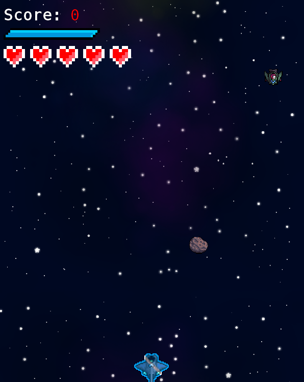
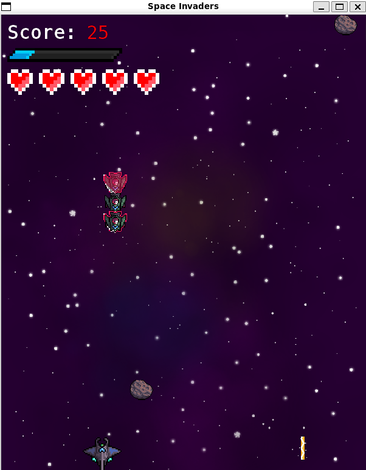
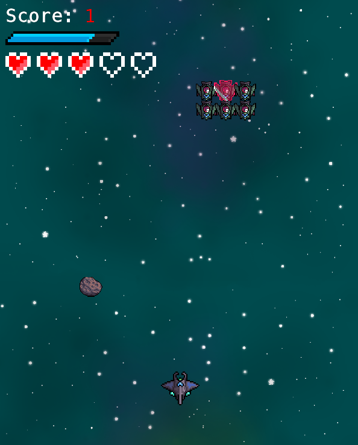
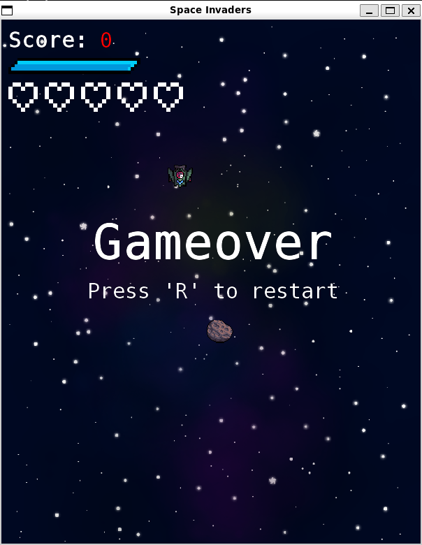

# Bauen und ausführen im JupyterHub: 

1. Im Terminal diesen Ordner öffnen.
2. Beim ersten mal die Befehle `make getSFML` und `make getGTest` ausführen, um benötigte Bibliotheken herunterzuladen.
3. Das Projekt und die Tests werden mit `make game` und `make tests` gebaut.
4. Um beides erfolgreich ausführen zu können, den SFML-Library-Path mit `export LD_LIBRARY_PATH=./build/SFML/lib:$LD_LIBRARY_PATH` hinterlegen.
5. Das Spiel oder die Test ausführen (in der Konsolen-Anwendung, nicht VSCode!): `./game` oder `./tests`

# Erklärung
## Ziel des Spiels: 

    Ziel des Spiels ist es, alle Aliens abzuschießen um sie davon abzuhalten, an den unteren Rand des Feldes anzukommen. Dabei werden Punkte gesammelt und Level abgeschlossen.

## Steuerung:

    Anders als beim klassischen Space Invaders kann sich das Raumschiff in dieser Version in alle Richtungen bewegen, anstatt nur nach links und rechts.

    Bewegen kann man sich über WASD:

    W = vorwärts
    A = links
    S = rückwärts
    D = rechts

    Geschossen wird mit der Leerzeichen-Taste

## Spiel-Ablauf:

    Allgemein:

        Das Raumschiff der spielenden Person startet mittig am unteren Rand des Spielfeldes. 
        
        Man verliert Leben, wenn man von Alien-Schüssen oder Meteoren getroffen wird.

        Sobald man von etwas getroffen wird, blinkt das Raumschiff für kurze Zeit. In dieser Zeit ist man unverwundbar, kann also keine Leben verlieren.

    Leben, Score und Schild: 

        Zu Beginn hat man 5 Leben und der Score ist auf 0 gesetzt(angezeigt durch "Score" und die Herzen oben links).

        Zudem befindet sich zwischen Score und Leben eine blaue Leiste. Diese zeigt den Ladeprozess eines Schildes an, welches das Raumschiff erhält, sobald die Leiste voll geladen ist. 
        Das Spiel startet mit einer vollen Leiste, also hat das Raumschiff bereits zu Beginn ein Schild (wie im Bild als blau schimmernde Schicht zu erkennen).

        Dieses Schild schützt einmalig davor, ein Leben zu verlieren. 
        Sobald man mit etwas getroffen wird, ist das Schild zerstört und die Leiste wird zurückgesetzt und lädt sich von Neuem auf (wie im zweiten Bild zu sehen).

        

    Meteoren:

        Die Meteorenfliegen fliegen in bestimmten Zeitabständen von oben runter (als Steine im Bild zu erkennen).
        Diesen muss das Raumschiff ausweichen, da es sonst ein Leben verliert.
        Meteoren können nicht zerstört werden und die Schüsse des Raumschiffs werden von ihnen absorbiert.

    Aliens und Level:

        Aliens kommen als Einheit zunächst langsam mittig runter, bis sie sich auf einer gewissen Höhe befinden. 
        Danach bewegen sie sich in dieser Einheit von einer Seite zur anderen, wobei sie sich immer ein Stück runter bewegen, sobald sie den Rand des Spielfeldes erreichen.

        Aliens können ebenfalls schießen. Diesen Schüssen muss man, wie auch den Meteoren, ausweichen.
        Einzelne Aliens besitzen auch ein Schild, was man daran erkennt, dass sie rot schimmern (siehe Bilder).
        Diese Aliens muss man zweimal treffen, um sie auszulöschen: das erste mal, um das Schild zu zerstören, das zweite mal, um das Alien auszulöschen, wie ein normales Alien auch.

        Jedes ausgelöschte Alien erhöht den Score. 
        Sobald eine Einheit von Aliens besiegt worden ist, ist ein Level geschafft und man wechselt automatisch zum nächsten. 
        Dies erkennt man daran, dass der Hintergrund seine Farbe wechselt (siehe das nächste Bild). 
        Mit höherem Level steigt auch die Anzahl an Aliens in der Einheit.

    Spiel-Ende:

        Das Spiel ist zu Ende (Game Over), wenn man keine Leben mehr hat oder die Aliens den unteren Rand des Spielfeldes erreicht haben.
        Wenn das passiert, steht auf dem Bildschirm "Game Over" und um das Spiel neu zu starten, muss man 'R' drücken (siehe das nachfolgende Bild).
    

    